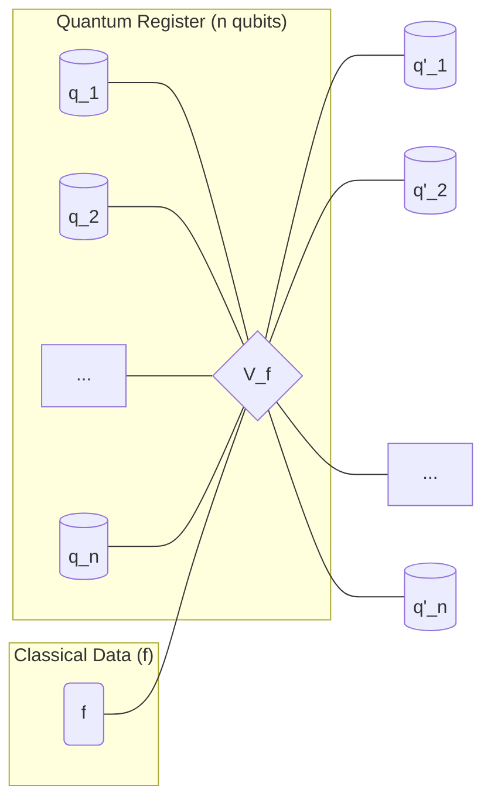

# Chapter 1: QRAM Operation

Welcome to the tutorial for `miniature-guacamole`! This project dives deep into a fascinating concept in quantum computing: Quantum Random Access Memory, or QRAM.

You're probably familiar with classical RAM (Random Access Memory) in your computer. It's where your computer stores data it's actively using, like documents, program instructions, and temporary files. Classical RAM is great because it allows the computer to quickly access any piece of data if it knows the address where that data is stored. Think of it like a giant set of mailboxes. If you have the address (mailbox number), you can open that specific mailbox and get the letter inside. You read one letter at a time.

Quantum computers also need to access data, often large amounts of classical data. But quantum computers can do things classically computers can't, like being in superposition. What if you wanted to access data _while_ your quantum computer's address register (the part that holds the address) is in a superposition of many different addresses? This is where QRAM comes in.

The idea behind QRAM is to allow a quantum computer to access classical data even when the address is not a single, definite address, but rather a quantum superposition of many addresses. Instead of just reading one piece of data, a QRAM operation can, in a sense, access _all_ the data items corresponding to the addresses in the superposition, all at once!

In this project, we're focusing on a specific, basic type of QRAM operation. This operation doesn't read the classical data into a quantum register in the traditional sense (like `|address>|0> -> |address>|data`). Instead, it applies a phase (a kind of quantum 'tag') to each part of the superposition based on the classical data stored at that address.

Let's define this specific QRAM operation, which we'll call `V(f)`.

## What is the QRAM Operation?

Imagine you have a list of $2^n$ classical bits. We can think of this list as a function, `f`, that takes an $n$-bit address `x` and gives you a single bit `f(x)` (either 0 or 1). So, `f(00...0)` is the first bit, `f(00...1)` is the second, and so on, up to `f(11...1)`. This list `f` is our classical dataset.

Now, suppose you have a quantum register consisting of $n$ qubits. This register holds a quantum state which can be a superposition of all possible $n$-bit addresses. We can write this state as:

$$
\sum_{x \in \{0,1\}^n} \alpha_x \ket{x}
$$

Here, `|x>` represents the state where the $n$ qubits are set to the bitstring `x`, and $\alpha_x$ is the complex amplitude for that specific address.

The `V(f)` operation takes this $n$-qubit quantum state and modifies the amplitude $\alpha_x$ for each address `x` based on the value `f(x)` from your classical dataset. Specifically, if `f(x)` is 1, the operation adds a $-1$ phase to the amplitude $\alpha_x$. If `f(x)` is 0, the amplitude remains unchanged (since $(-1)^0 = 1$).

Mathematically, the operation looks like this:

$$
V(f): \sum_{x \in \{0,1\}^n} \alpha_x \ket{x} \quad \longmapsto \quad \sum_{x \in \{0,1\}^n} (-1)^{f(x)} \alpha_x \ket{x}
$$

This is a unitary operation, meaning it's a valid transformation in quantum mechanics. It's also a _diagonal_ operation in the computational basis, because it only changes the phases of the basis states `|x>` and doesn't mix them together.

Think of our mailbox analogy again. Classical RAM lets you open one mailbox (`|address>`) and read the letter (`data`). This QRAM `V(f)` operation is like simultaneously _tagging_ every mailbox in your superposition based on whether its letter (f(x)) is 1 or 0. The tagging doesn't tell you _which_ mailbox was tagged (that would collapse the superposition), but the overall quantum state now holds information about the entire dataset `f` encoded in the phases.

## Representing the Operation

While we don't have a simple code snippet to _implement_ this complex operation directly at a fundamental level in a few lines for a beginner, we can visualize it conceptually using a quantum circuit diagram. Since `V(f)` acts on an $n$-qubit register, we can represent it as a single gate acting on all $n$ qubits simultaneously, conditioned on the classical data `f`.

In this diagram, the wires represent the $n$ quantum qubits, and the box labeled `V(f)` represents the unitary operation. The arrow from `f` indicates that the operation depends on the entire classical dataset `f`.

## The Challenge Ahead

This ideal `V(f)` operation is very powerful and is a key component in many proposed quantum algorithms that promise exponential speedups. However, actually _building_ a physical device that can perform this operation reliably and efficiently on many qubits ($n$ large enough that $2^n$ is huge, like $n=40$ corresponding to a terabyte of data) is extremely challenging. This is especially true when we consider errors and the need for fault-tolerant quantum computation.

Naively implementing `V(f)` with standard quantum gates would require an exponentially large quantum circuit with $O(2^n)$ gates and ancilla qubits, which is impractical. Building a specialized physical QRAM device might be possible, but even then, errors are unavoidable. How can we perform this `V(f)` operation fault-tolerantly using a noisy QRAM device, without requiring an exponential amount of additional fault-tolerant quantum hardware?

This is the central question this project, `miniature-guacamole`, aims to address. This chapter has introduced the abstract, ideal `V(f)` operation. In the following chapters, we will build up the concepts and techniques needed to perform this operation fault-tolerantly using a specialized, potentially noisy, QRAM device.

## Conclusion

In this chapter, we introduced the QRAM operation `V(f)`, which applies a phase $(-1)^{f(x)}$ to each component `|x>` of an $n$-qubit address register in superposition, based on a classical dataset `f`. This operation is crucial for many quantum algorithms but is difficult to implement fault-tolerantly.

In the next chapter, we'll start exploring the world of Fault-tolerant Quantum Computation (FTQC), which provides the tools to deal with noise in quantum computers. This will be essential for understanding how we can make the QRAM operation reliable.

[Fault-tolerant Quantum Computation (FTQC)](02_fault_tolerant_quantum_computation__ftqc__.md)

---

Generated by [AI Codebase Knowledge Builder](https://github.com/The-Pocket/Tutorial-Codebase-Knowledge). **References**: [[1]](https://github.com/BorissovAnton/miniature-guacamole/blob/561cc0eae83fae19829c1a65c3478067f59cdeef/main.tex)
