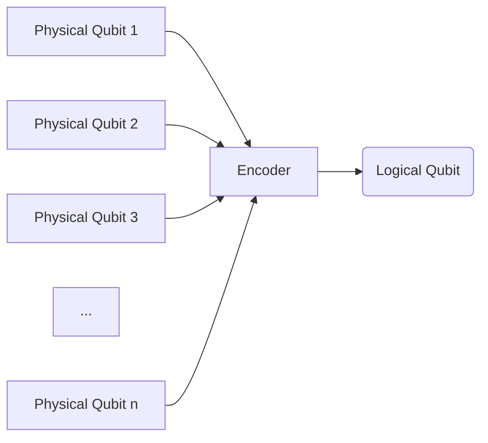

# Chapter 2: Fault-tolerant Quantum Computation (FTQC)

Welcome back to the `miniature-guacamole` tutorial!

In [Chapter 1: QRAM Operation](01_qram_operation_.md), we learned about the amazing power of Quantum Random Access Memory (QRAM) and a specific operation, `V(f)`, that applies a phase to a superposition of addresses based on a classical dataset. We also touched upon the huge challenge of actually building such a device, especially one that works reliably.

Why is reliability such a big problem in quantum computing? That's what this chapter is all about! We'll introduce the crucial concept of Fault-tolerant Quantum Computation, or FTQC.

## Why Do We Need FTQC? The Problem of Noise

Imagine trying to build a computer where the bits flip randomly sometimes. If it's a classical computer, you can use error correction. A simple way is to store each bit three times (`0` becomes `000`, `1` becomes `111`). If you later read `001`, you know the original bit was likely `0` because two out of three agree. You can easily copy bits and check them without disturbing their state.

Quantum computers face similar problems, but they are much harder to solve.

1.  **Quantum bits (qubits) are fragile:** They can easily lose their information or get corrupted by their environment (like stray magnetic fields or vibrations). This is called **decoherence**.
2.  **Errors are continuous:** Classical bits are either 0 or 1. Quantum errors can be more complex, like a slight rotation of a qubit's state.
3.  **The No-Cloning Theorem:** You can't make an exact copy of an unknown quantum state. This means the simple classical trick of tripling your bits doesn't directly work. If you try to copy a qubit to check for errors, you'll fail!
4.  **Errors accumulate:** If noise affects your qubits and gates throughout a computation, the errors can build up quickly, messing up your final result.

Without a way to deal with noise, quantum computations would quickly become useless, especially for the large, complex tasks quantum computers are supposed to be good at. This is where FTQC comes in.

FTQC is the overall strategy to perform quantum calculations reliably, even when the physical hardware is noisy and prone to errors.

## The Two Pillars of FTQC

FTQC relies mainly on two big ideas working together:

### 1. Quantum Error Correction (QEC)

Since we can't copy qubits directly, QEC uses a different approach. Instead of storing information in a single physical qubit, it's spread out (encoded) across _multiple_ physical qubits in a clever way. This creates a **logical qubit**.

Think of it like writing a secret message on several pieces of paper and distributing them. If one piece gets slightly smudged (a physical error), the information might still be recoverable from the other pieces.

Here's a simplified view:



A key part of QEC is being able to detect and correct errors on these physical qubits _without_ measuring the logical qubit's state itself (which would collapse its delicate superposition). This is done by performing special measurements called **stabilizer measurements**. These measurements tell you if an error _occurred_ and _where_ it happened (which physical qubits were affected), but _not_ the specific quantum information stored in the logical qubit.

Based on the outcome of these stabilizer measurements (called the **syndrome**), classical computation is used to figure out what error likely happened and what operations are needed to correct it. These correction operations are then applied to the physical qubits. This whole process needs to be repeated often during a quantum computation to catch and fix errors before they spread too much.

### 2. Fault-tolerant Operations

Even if your quantum information is protected by QEC, applying quantum gates or making measurements can introduce new errors. If you simply applied a standard gate (like a CNOT) between two physical qubits belonging to different logical qubits, an error on one of those physical qubits could easily spread, affecting _both_ logical qubits. This would be a disaster!

Fault-tolerant operations are special ways of performing gates or measurements on logical qubits such that any new error introduced only affects the physical qubits belonging to _one_ logical qubit. They prevent errors from propagating uncontrollably across logical qubits.

Often, this means a single logical gate requires many physical gates, carefully arranged, sometimes involving extra temporary physical qubits (called ancilla qubits) that are also protected by QEC.

```code
graph TD
    subgraph Logical Qubit 1
        lq1[(Logical Qubit)]
    end
    subgraph Logical Qubit 2
        lq2[(Logical Qubit)]
    end

    lq1 --> FT_Gate["Fault-tolerant Gate\n(Many physical gates)"]
    lq2 --> FT_Gate

    FT_Gate --> lq1_out[(Logical Qubit)]
    FT_Gate --> lq2_out[(Logical Qubit)]
```

By combining QEC (to protect stored information) with fault-tolerant operations (to protect operations), FTQC provides a path to perform arbitrarily long and complex quantum computations with a very low probability of logical errors, provided the physical error rate is below a certain **threshold**.

## FTQC and the QRAM Challenge

Now, let's connect this back to our QRAM operation `V(f)`. Our goal is to perform `V(f)` on a logical address register (a set of $n$ logical qubits). A naive approach would be to take the $n$ logical qubits, decode them into $n$ physical qubits, apply the physical `V(f)` operation with a hypothetical physical QRAM device, and then re-encode the $n$ physical qubits back into $n$ logical qubits.

However, as we discussed in [Chapter 1](01_qram_operation_.md), even the ideal physical `V(f)` operation involves interacting with an exponentially large ($2^n$) classical dataset. Building a simple, low-depth physical device to do this is hard, and ensuring it's perfectly error-free is impossible. If this device has noise, or if the decoding/re-encoding steps aren't fault-tolerant, errors would be rampant and uncorrectable.

Moreover, implementing `V(f)` directly as a circuit using standard fault-tolerant gates (like fault-tolerant CNOTs, Hadamards, etc.) would require an exponentially large quantum circuit ($O(2^n)$ gates and ancilla qubits), as mentioned in Chapter 1. All these fault-tolerant gates and ancilla qubits would need continuous quantum error correction. This would make QRAM incredibly expensive, requiring exponentially many fault-tolerant resources, potentially eliminating the quantum speedup for many algorithms.

This project, `miniature-guacamole`, operates within the FTQC framework. It aims to find a way to perform the logical QRAM operation `V(f)` reliably _without_ requiring either a perfect physical QRAM device _or_ an exponentially large fault-tolerant quantum circuit. It seeks a method that uses only a _polynomial_ number of fault-tolerant quantum resources ($O(\poly(n))$ gates, qubits, etc.) on a standard quantum computer, even if it needs to interact with a noisy QRAM device.

How can this be done? The project explores a specific FTQC technique involving the preparation of special quantum states called **resource states** (sometimes called magic states) and using a process called **gate teleportation**. We will delve into these techniques and how they are adapted for the QRAM operation in later chapters.

## Conclusion

In this chapter, we introduced Fault-tolerant Quantum Computation (FTQC) as the essential framework for building reliable quantum computers in the presence of noise. We learned that FTQC relies on:

- **Quantum Error Correction (QEC):** Encoding quantum information across multiple physical qubits to create robust logical qubits and using special measurements (stabilizer measurements) to detect errors without disturbing the logical state.
- **Fault-tolerant Operations:** Designing gates and measurements that prevent errors from spreading uncontrollably between logical qubits.

We also highlighted the challenge FTQC poses for the QRAM operation – performing `V(f)` reliably is difficult due to the need to interact with an exponentially large dataset. This project aims to address this challenge using specific FTQC protocols.

In the next chapter, we will look more closely at the idea of a specialized, potentially noisy, physical QRAM device and what properties it might need for our fault-tolerant protocol.

[Physical QRAM Device](03_physical_qram_device_.md)

---

<sub><sup>Generated by [AI Codebase Knowledge Builder](https://github.com/The-Pocket/Tutorial-Codebase-Knowledge).</sup></sub> <sub><sup>**References**: [[1]](https://github.com/BorissovAnton/miniature-guacamole/blob/561cc0eae83fae19829c1a65c3478067f59cdeef/main.tex)</sup></sub>
