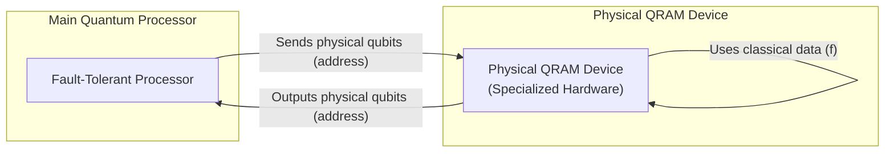
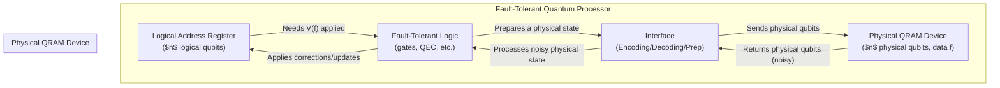

# Chapter 3: Physical QRAM Device

Welcome back to the `miniature-guacamole` tutorial!

In [Chapter 1: QRAM Operation](01_qram_operation_.md), we introduced the ideal QRAM operation, `V(f)`, which applies a phase based on classical data to an address register that can be in a quantum superposition. We saw how powerful this operation is but also how difficult it would be to implement directly using standard quantum gates and a fault-tolerant quantum computer, requiring an exponentially large circuit.

In [Chapter 2: Fault-tolerant Quantum Computation (FTQC)](02_fault_tolerant_quantum_computation__ftqc__.md), we learned why building reliable quantum computers is so hard due to noise, and how FTQC uses concepts like Quantum Error Correction (QEC) and fault-tolerant gates to protect quantum information and operations. We highlighted the central problem this project tackles: how to perform the QRAM operation `V(f)` fault-tolerantly without an exponentially large fault-tolerant quantum circuit.

This brings us to the idea of a **Physical QRAM Device**.

## What is a Physical QRAM Device?

Imagine your classical computer again. It has a CPU (Central Processing Unit) that does the main calculations, but it also has separate, specialized hardware for things like graphics (GPU) or accessing data (RAM chips). These are often designed differently from the CPU, optimized for their specific tasks.

In the same spirit, a **Physical QRAM Device** is a hypothetical, specialized piece of quantum hardware designed _specifically_ to perform the basic QRAM operation, `V(f)`. It's separate from the main, general-purpose fault-tolerant quantum processor (the part of the quantum computer capable of complex, error-corrected calculations).

Think of it as a black box or a dedicated chip. You feed in $n$ physical qubits representing the address register, and the device interacts with the $2^n$ classical bits of data `f` stored within it, and ideally, it spits out the _same_ $n$ physical qubits but with the phases updated according to `V(f)`.

This physical device aims to solve the problem of the exponentially large circuit we discussed in Chapter 1. Instead of building `V(f)` from many small, general-purpose quantum gates, maybe there's a way to build a dedicated piece of hardware that can perform _this specific operation_ much more efficiently, perhaps using completely different physical principles or architectures optimized for data access rather than universal computation.

Some theoretical proposals exist for what such a device might look like, often involving optical or atomic systems arranged in structures like a "bucket brigade". The hope is that such a device could perform the operation very quickly, maybe in time proportional to `n` (poly(n)), similar to how classical RAM access time scales with the number of address bits.

## Key Characteristics of the Physical QRAM Device

Based on the context of this project, the hypothetical physical QRAM device has some specific traits:

- **It operates on Physical Qubits:** The device takes $n$ _physical_, unencoded qubits as input and outputs $n$ physical qubits. It doesn't directly handle the 'logical' qubits used in fault-tolerant computation.
- **It's Fast (ideally poly(n)):** The design goal is that this device can perform the `V(f)` operation on $n$ qubits much faster than a naive circuit implementation, ideally in time scaling polynomially with $n$, like $O(n)$ or $O(n^2)$. This keeps the promise of quantum speedups that rely on fast data access.
- **It Can Be Noisy:** Unlike the main fault-tolerant processor, this specialized device doesn't need to be perfectly error-free. It's assumed it _will_ introduce errors.
- **Noise is Independent of the Data:** A crucial assumption for our protocol is that the type or strength of the noise introduced by the device doesn't depend on the specific classical data `f` being queried. This might mean the noise comes mainly from the hardware structure itself, not the data values stored.
- **Minimum Output Fidelity:** While noisy, the device isn't completely useless. It's assumed that the output state has a non-zero fidelity (overlap) with the ideal state `V(f)|+>^n`, and this fidelity is at least inverse polynomial in `n` (e.g., $1/\poly(n)$). It doesn't have to be high fidelity, just better than random.

Let's summarize these assumptions in a table:

| Characteristic                  | Description                                                                    | Why it matters                                                              |
| :------------------------------ | :----------------------------------------------------------------------------- | :-------------------------------------------------------------------------- |
| **Separate Hardware**           | Not part of the main fault-tolerant processor.                                 | Allows specialized design, potentially bypassing circuit complexity limits. |
| **Operates on Physical Qubits** | Works directly on unencoded qubits.                                            | Simpler design for the device itself, but creates challenges for FTQC.      |
| **Fast (Poly(n))**              | A single operation takes time like $O(n^k)$.                                   | Essential for algorithms that rely on fast QRAM access for speedup.         |
| **Can Be Noisy**                | The output isn't perfect; errors are introduced.                               | Reflects realistic hardware limitations; FTQC is needed to handle this.     |
| **Data-Independent Noise**      | The noise channel doesn't change based on the specific data `f`.               | A technical assumption our protocol uses to manage errors.                  |
| **Inverse Poly(n) Fidelity**    | The output has some minimum overlap with the correct state, $ \ge 1/\poly(n)$. | Ensures the output isn't pure noise and can be improved via distillation.   |

## The New Challenge: Bridging the Gap to Fault Tolerance

So, we have this hypothetical physical QRAM device. It can do the `V(f)` operation fast on physical qubits, but it's noisy. The main quantum processor is fault-tolerant but would take exponentially long to do `V(f)` itself.

How do we use this fast, noisy physical device to perform the _logical_, fault-tolerant `V(f)` operation required for reliable quantum algorithms running on logical qubits?

Simply taking our logical address register, decoding it to physical qubits, sending them through the noisy physical QRAM device, and re-encoding them won't work.

1.  Decoding and re-encoding processes themselves can introduce errors if not done fault-tolerantly.
2.  Any noise from the physical QRAM device would directly propagate to the logical qubits, potentially introducing uncorrectable logical errors.

This is the central challenge that the rest of this project, `miniature-guacamole`, is designed to address. We need a protocol that can leverage the speed of the physical QRAM device while mitigating its noise, using the capabilities of the fault-tolerant quantum processor.

## Conceptual Picture

Let's update our conceptual diagram to show the interplay between the fault-tolerant processor and the specialized physical QRAM device.

_(Note: This is a simplified view. The actual protocol involves preparing special 'resource states' using the QRAM device, which are then processed by the FTQC logic.)_

The interface box represents the crucial step of transferring information between the logical world of the fault-tolerant processor and the physical world of the QRAM device. This transfer must be handled carefully to manage errors.

## Conclusion

In this chapter, we introduced the concept of a **Physical QRAM Device** as a specialized piece of hardware distinct from the main fault-tolerant quantum processor. This device is designed to perform the basic QRAM operation `V(f)` quickly on physical qubits. While promising speed, it's assumed to be noisy, with noise independent of the data, but having a minimum fidelity.

The existence of such a device presents a new challenge: how to use its speed while dealing with its noise, to implement the desired logical, fault-tolerant QRAM operation needed for complex quantum algorithms.

In the next chapter, we'll look closer at how quantum information is protected in FTQC through **Encoding and Quantum Error Correction (QEC)**. Understanding this is key to seeing how we can take the noisy output of the physical QRAM device and make it useful for a fault-tolerant computation.

[Encoding and Quantum Error Correction (QEC)](04_encoding_and_quantum_error_correction__qec__.md)

---

Generated by [AI Codebase Knowledge Builder](https://github.com/The-Pocket/Tutorial-Codebase-Knowledge). **References**: [[1]](https://github.com/BorissovAnton/miniature-guacamole/blob/561cc0eae83fae19829c1a65c3478067f59cdeef/main.tex)
