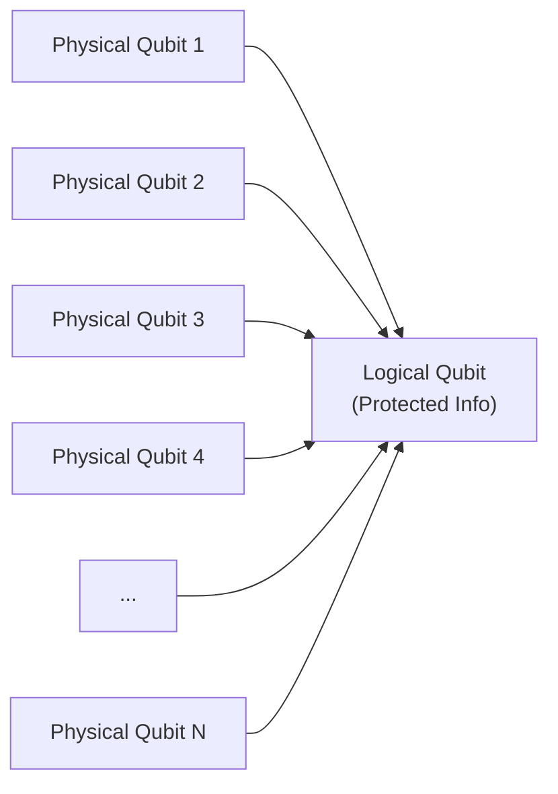
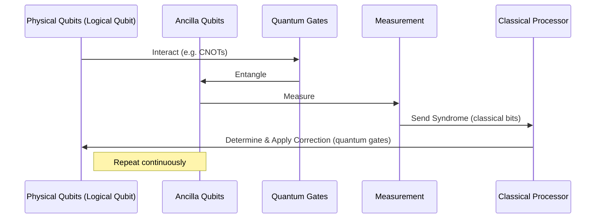

# Chapter 4: Encoding and Quantum Error Correction (QEC)

Welcome back to the `miniature-guacamole` tutorial!

In [Chapter 1: QRAM Operation](01_qram_operation_.md), we introduced the powerful `V(f)` operation that our project is focused on. In [Chapter 2: Fault-tolerant Quantum Computation (FTQC)](02_fault_tolerant_quantum_computation__ftqc__.md), we learned _why_ fault tolerance is necessary – quantum computers are inherently noisy. Then, in [Chapter 3: Physical QRAM Device](03_physical_qram_device_.md), we discussed the concept of a specialized, potentially noisy, piece of hardware designed to perform the `V(f)` operation quickly on physical qubits.

The big challenge is connecting the noisy physical world of the QRAM device with the reliable logical world of a fault-tolerant quantum computer. How can we use a device that makes mistakes to perform a computation that needs to be highly accurate? The answer lies in the core technologies of FTQC, which we touched upon in Chapter 2: **Encoding** and **Quantum Error Correction (QEC)**. This chapter dives deeper into these essential concepts.

## Why We Can't Ignore Errors

Imagine you're trying to build a very complex machine using extremely fragile parts. Any small bump or vibration could break a piece or change its state. If you link many such fragile parts together, the chances of the whole machine failing become very high, very quickly.

Quantum computers are like that. The qubits are easily affected by their environment (noise), causing errors like unwanted flips (bit errors, like classical 0 to 1) or phase shifts (phase errors, unique to quantum systems). As quantum computations involve linking many qubits and performing long sequences of operations, these errors build up rapidly. Without a way to combat this noise, large-scale quantum computers would be impossible.

This is where Quantum Error Correction comes in.

## Encoding: Spreading the Quantum Secret

The first key idea in QEC is **encoding**. Instead of storing one piece of quantum information (like the state of a single logical qubit) in just _one_ physical qubit, we spread that information out across _multiple_ physical qubits.

Think of it like writing a secret message on several separate pieces of paper using a special code. If one piece of paper gets slightly damaged (a physical error on one qubit), the information might still be recoverable from the other pieces. The secret isn't concentrated in one place; it's distributed.

This group of physical qubits, working together to hold the state of one piece of quantum information, forms a **logical qubit**.

_Conceptual diagram: A logical qubit is formed by encoding information across N physical qubits._

A simple analogy (though imperfect for quantum) is classical repetition code: to protect a bit 0, you store 000. If one bit flips (010), you can tell an error occurred. Quantum encoding is more sophisticated because it must protect superpositions and entanglement without violating the no-cloning theorem. For example, a logical |0> might be a specific entangled state of many physical qubits, and a logical |1> would be another specific entangled state.

## Quantum Error Correction: The Constant Vigilance

Encoding alone isn't enough. Errors can still happen to the physical qubits _after_ encoding. QEC is the **ongoing process** of:

1.  **Detecting** that an error has occurred.
2.  **Locating** where the error happened (which physical qubits).
3.  **Applying corrections** to fix the error.

All of this must be done _without_ disturbing the delicate quantum information stored in the logical qubit. If we simply measured the physical qubits directly, we'd collapse the superposition of our logical qubit, ruining the computation.

### How QEC Works (at a high level): Syndrome Measurement

Instead of measuring the data directly, QEC uses special measurements called **syndrome measurements** (or stabilizer measurements). These measurements are designed to tell you _if_ and _where_ an error occurred, but _not_ what the protected quantum state is.

Imagine our secret message on multiple pieces of paper again. Instead of reading the message, you might check if the edges of two pieces line up correctly, or if the total number of words on a subset of papers is even or odd. This check gives you information about damage _without_ revealing the secret words themselves.

In quantum computing, syndrome measurements check properties of the entanglement between the physical qubits forming the logical qubit. The result of a syndrome measurement (the "syndrome") is classical information.

_Conceptual sequence: The QEC cycle. Ancilla qubits are used to perform measurements that reveal error syndromes without touching the protected data qubits._

Based on the syndrome, a classical computer figures out the most likely error that occurred and calculates the required quantum operation(s) to fix it. These correction operations (usually simple Pauli gates) are then applied to the physical qubits. This whole cycle of measurement, classical processing, and correction needs to happen frequently – often many times for every logical operation or just to keep information stored reliably.

## QEC and `miniature-guacamole`: Handling the Noisy QRAM

Now, let's link this back to our project.

Our goal is to perform the logical `V(f)` operation on an address register composed of `n` logical qubits. Each logical qubit is protected by encoding and maintained via continuous QEC.

The [Physical QRAM Device](03_physical_qram_device_.md) operates on _n physical qubits_. Its output is noisy. We cannot simply take the noisy physical output and use it directly as a logical qubit, or try to decode our logical qubits into noisy physical qubits, send them through the noisy QRAM, and re-encode. Errors introduced by the noisy device or during imperfect encoding/decoding steps would likely overwhelm the QEC system or create uncorrectable logical errors.

Our protocol relies on the capabilities of a standard fault-tolerant quantum processor (FTQC) that _already uses_ encoding and QEC. This processor can perform logical operations (like logical CNOTs, logical Hadamards, logical measurements) with very low logical error rates, provided the physical error rate is below a threshold and sufficient physical qubits are used for encoding and QEC.

Instead of directly using the noisy physical QRAM output as our final logical state, the `miniature-guacamole` protocol uses the noisy physical QRAM device to help **prepare a special quantum state** (we'll call it a "resource state") on _physical_ qubits. This noisy physical resource state is then carefully brought into the fault-tolerant processor.

Within the fault-tolerant processor, this noisy physical resource state is:

1.  **Encoded** into the logical space. This step itself needs to be handled carefully so it doesn't introduce too many errors.
2.  **Distilled** (a form of QEC state purification) using multiple copies of the noisy encoded state to create a higher-fidelity version.
3.  Used in a **Fault-tolerant operation** (specifically, Gate Teleportation) to perform the desired logical `V(f)` operation on our logical address register.

This is the power of FTQC: even if one part of your system (like the physical QRAM device) is noisy, you can use the error-correcting capabilities of the main processor to process the noisy outputs and produce a clean logical result, as long as the noise isn't _too_ bad.

This chapter has provided the foundational understanding of how quantum information is protected in fault-tolerant quantum computers through encoding and continuous error correction. This protection is what allows us to even consider using a noisy component like the physical QRAM device.

## Conclusion

In this chapter, we explored **Encoding** and **Quantum Error Correction (QEC)**. Encoding protects quantum information by spreading it across multiple physical qubits to form a logical qubit. QEC is the vital ongoing process of measuring for errors (syndrome measurement) and applying corrections without disturbing the protected logical state. These techniques are fundamental to building reliable fault-tolerant quantum computers.

The `miniature-guacamole` project operates within this FTQC framework. Understanding how logical information is protected is crucial for the next step: learning about the special "resource state" that our protocol uses the noisy physical QRAM device to create.

[QRAM Resource State](05_qram_resource_state_.md)

---

Generated by [AI Codebase Knowledge Builder](https://github.com/The-Pocket/Tutorial-Codebase-Knowledge). **References**: [[1]](https://github.com/BorissovAnton/miniature-guacamole/blob/561cc0eae83fae19829c1a65c3478067f59cdeef/main.tex)
