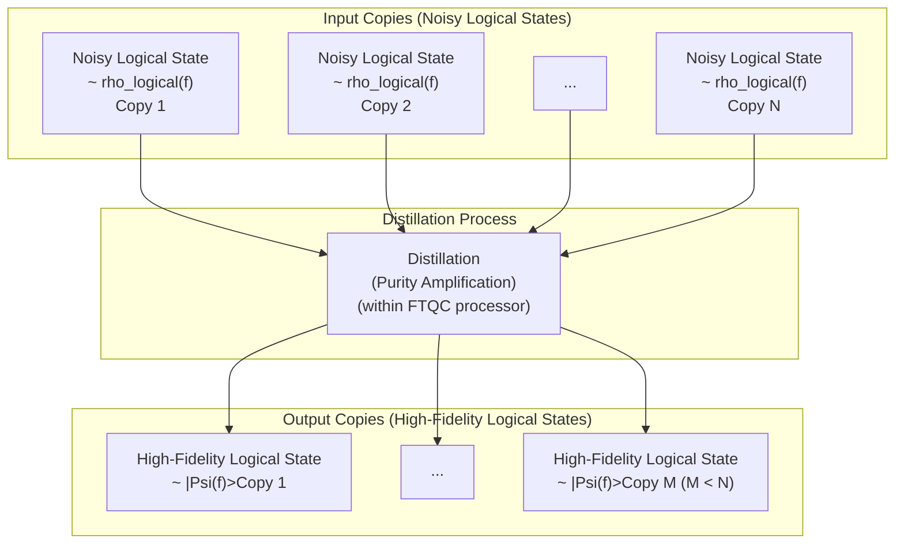
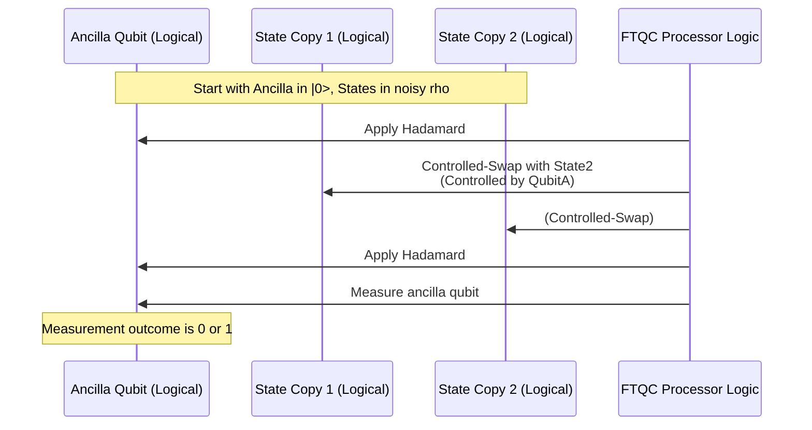

# Chapter 6: Distillation (Purity Amplification)

Welcome back to the `miniature-guacamole` tutorial!

In [Chapter 1: QRAM Operation](01_qram_operation_.md), we learned about the ideal `V(f)` operation. [Chapter 2: Fault-tolerant Quantum Computation (FTQC)](02_fault_tolerant_quantum_computation__ftqc__.md) highlighted the necessity of dealing with noise. [Chapter 3: Physical QRAM Device](03_physical_qram_device_.md) introduced the idea of a specialized, fast, but potentially **noisy** device. [Chapter 4: Encoding and Quantum Error Correction (QEC)](04_encoding_and_quantum_error_correction__qec__.md) explained how we encode quantum information across multiple physical qubits to make logical qubits more robust against errors. In [Chapter 5: QRAM Resource State](05_qram_resource_state_.md), we saw that our protocol needs a special **QRAM Resource State**, $|\Psi(f)\rangle = V(f)|+\rangle^n$, as a key ingredient for performing the `V(f)` operation fault-tolerantly via gate teleportation.

However, we also learned that our noisy physical QRAM device produces a noisy version of this state ($\tilde{\rho}_{\text{phys}}(f)$). Even after encoding it into logical qubits ($\tilde{\rho}_{\text{logical}}(f)$), the state is still noisy. Gate teleportation (which we'll cover in the next chapter) requires a _high-fidelity_ resource state – one that is very, very close to the ideal pure state $|\overline{\Psi(f)}\rangle \langle \overline{\Psi(f)}|$. How do we get a clean, high-quality state from a noisy one?

This is where **Distillation (Purity Amplification)** comes in.

## What is Distillation?

Imagine you have a large quantity of slightly contaminated water. You can't just use it for a sensitive experiment. You need pure water. Distillation is a process to take that large quantity of impure water and process it to get a _smaller_ quantity of much _purer_ water.

Quantum state distillation is a very similar concept. It's a quantum process that takes many copies of a noisy, mixed quantum state (think of "mixed" as "impure" or "blurry") and, through careful quantum operations and measurements, outputs fewer copies of a state that is much closer to the desired pure state (think of "pure" as "clean" or "sharp").

The key ideas are:

1.  **Many in, few out:** You start with many noisy copies, and you end up with fewer (or even just one) cleaner copies.
2.  **Quality improvement:** The output states have significantly higher _fidelity_ (closeness) to the target pure state than the input states did.
3.  **Same state type:** The distillation process doesn't change _what_ state you're trying to prepare (e.g., if you're distilling a noisy `|T>` state, you get a cleaner `|T>` state, not a cleaner `|+>` state). It only improves its purity/quality.
4.  **Probabilistic or Postselected:** Distillation protocols often involve measurements. Success might be probabilistic (you only get the clean state with a certain probability) or they might require discarding states based on measurement outcomes (postselection). If a distillation attempt fails or indicates a bad input state, you just discard the result and try again with fresh copies.

## Why Distillation for Our QRAM Resource State?

In [Chapter 5](05_qram_resource_state_.md), we saw that the output of our noisy physical QRAM device, even after encoding, is a noisy logical state $\ol{\phi(g)}$. While this state might have some overlap (fidelity) with the ideal logical resource state $|\overline{\Psi(g)}\rangle$, it's likely not high enough for reliable fault-tolerant gate teleportation.

Our protocol uses distillation to "purify" these noisy logical QRAM resource states. We take many copies of $\ol{\phi(g)}$ and run them through a distillation process within the fault-tolerant quantum processor. The output is a state $\ol{\phi(g)}_{\text{dist}}$, which is much closer to the ideal $|\overline{\Psi(g)}\rangle$.



```code
flowchart TD
    subgraph "Input Copies (Noisy Logical States)"
        noisy_copy1["Noisy Logical State<br/>~ rho_logical(f)<br/>Copy 1"]
        noisy_copy2["Noisy Logical State<br/>~ rho_logical(f)<br/>Copy 2"]
        noisy_copy_dots["..."]
        noisy_copy_N["Noisy Logical State<br/>~ rho_logical(f)<br/>Copy N"]
    end

    noisy_copy1 --> DistillProcess
    noisy_copy2 --> DistillProcess
    noisy_copy_dots --> DistillProcess
    noisy_copy_N --> DistillProcess

    subgraph "Distillation Process"
        DistillProcess["Distillation<br/>(Purity Amplification)<br/>(within FTQC processor)"]
    end

    DistillProcess --> clean_copy1["High-Fidelity Logical State<br/>~ |Psi(f)><Psi(f)|<br/>Copy 1"]
    DistillProcess --> clean_copy_dots["..."]
    DistillProcess --> clean_copy_few["High-Fidelity Logical State<br/>~ |Psi(f)><Psi(f)|<br/>Copy M (M < N)"]

    subgraph "Output Copies (High-Fidelity Logical States)"
        clean_copy1
        clean_copy_dots
        clean_copy_few
    end
```

_(Conceptual diagram of distillation: Many noisy copies go in, fewer high-fidelity copies come out.)_

A key reason distillation works for our noisy QRAM resource state $\ol{\phi(g)}$ is related to its structure. Even though it's mixed with noise, the desired state $|\overline{\Psi(g)}\rangle$ is its **principal component** (or principal eigenvector). Think of the noisy state as a blurry picture: the ideal state is the main image you're trying to see, while the noise is the blurriness. Distillation protocols are designed to amplify this principal component and suppress the other parts (the noise).

As mentioned in the context of the paper, the protocol uses a technique called "Partial Clifford Twirling" when preparing the noisy physical state from the device. This twirling step helps ensure that, even with certain types of realistic noise from the device and encoding, the desired ideal state $|\overline{\Psi(g)}\rangle$ remains the principal component of the noisy logical state $\ol{\phi(g)}$. This is crucial because distillation protocols amplify the _principal_ component, whatever it might be. We need to ensure that component is the one we actually want!

## How Distillation Works (Conceptual Steps)

Specific distillation protocols vary, but many rely on properties that can be checked or amplified using multiple copies of the state and measurements. A common building block is the **Swap Test**.

The basic idea of a Swap Test on two copies of a state is to check how similar they are _without_ completely measuring their information.



_Conceptual sequence of a Swap Test building block._

If the two copies of the state ($\rho_1$ and $\rho_2$) are identical pure states, the measurement outcome on the ancilla qubit is always 0. If they are very different (e.g., orthogonal pure states), the outcome is always 1. If they are mixed states, or different pure states, the outcome is probabilistic. The probability of measuring 0 tells you about the overlap (fidelity) between the two states.

A distillation protocol might use this idea in various ways:

- Run a Swap Test on two noisy copies. If the result is 0 (indicating high similarity, suggesting they might both be closer to the ideal state), keep one or both copies (they are now slightly "purified" due to the postselection or the operation). If the result is 1, discard them.
- Combine multiple copies in more complex circuits involving controlled swaps and measurements. The measurement outcomes provide "syndrome" information, similar to QEC, that tells you about the noise in the set of copies. Based on this syndrome, you can apply corrections or select subsets of states that are likely purer.

By iterating such steps, consuming many initial noisy copies and applying operations and measurements, the protocols can output states with much higher fidelity to the desired pure state.

The specific distillation protocol used for `miniature-guacamole` is adapted for the $n$-qubit logical QRAM resource state. It consumes many copies of the noisy logical state $\ol{\phi(g)}$ and, using operations like controlled-SWAP gates (which act on $n$-qubit registers in this case!) and single-qubit measurements, produces fewer copies that are closer to $|\overline{\Psi(g)}\rangle$. The number of copies needed and the complexity of the process depend on how noisy the initial state is and how high a fidelity is required for the final distilled state.

## Distillation in the Overall Protocol Flow

Distillation fits into our overall fault-tolerant QRAM protocol right after the noisy physical state from the device has been prepared and encoded into logical qubits.

1.  The fault-tolerant processor instructs the physical QRAM device (with dataset $g$) to prepare a noisy physical state $\tilde{\rho}_{\text{phys}}(g)$.
2.  This state is moved to the processor and encoded into a noisy logical state $\ol{\phi(g)}$. Multiple copies of this state are prepared.
3.  (If needed) Partial Clifford Twirling logic is applied to ensure $|\overline{\Psi(g)}\rangle$ is the principal component.
4.  The processor takes many copies of the (potentially twirled) noisy logical state and performs a distillation protocol.
5.  This yields one (or a few) copies of a high-fidelity logical state $\ol{\phi(g)}_{\text{dist}}$.
6.  This high-fidelity state is now ready to be used as the "magic ingredient" for [Gate Teleportation](08_gate_teleportation_.md).

This crucial distillation step ensures that even though the specialized QRAM device is noisy, we can still obtain the high-quality quantum states needed for reliable fault-tolerant operations on our logical address register.

## Conclusion

In this chapter, we introduced **Distillation (Purity Amplification)** as a vital process in Fault-tolerant Quantum Computation. We learned that it takes many noisy copies of a quantum state and outputs fewer copies with significantly higher fidelity to the desired pure state. We saw why this is necessary for our project: to purify the noisy logical QRAM resource states produced by the physical device and encoding step, making them suitable for subsequent fault-tolerant operations.

Having obtained a high-fidelity logical QRAM resource state through distillation, we now have the key ingredient needed to perform the logical `V(f)` operation on our address register. In the next chapter, we will dive into **Gate Teleportation** and how this pure resource state is used to apply the desired QRAM transformation.

[Gate Teleportation](08_gate_teleportation_.md)

---

<sub><sup>Generated by [AI Codebase Knowledge Builder](https://github.com/The-Pocket/Tutorial-Codebase-Knowledge).</sup></sub> <sub><sup>**References**: [[1]](https://github.com/BorissovAnton/miniature-guacamole/blob/561cc0eae83fae19829c1a65c3478067f59cdeef/main.tex)</sup></sub>
