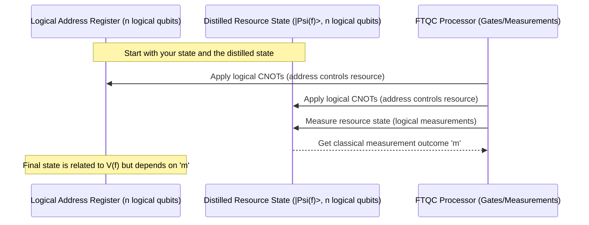
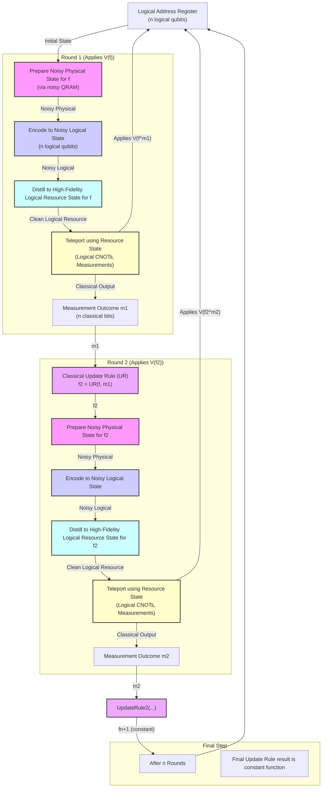

# Chapter 7: Logical QRAM Operation

Welcome back to the `miniature-guacamole` tutorial!

In the last chapter, [Chapter 6: Distillation (Purity Amplification)](06_distillation__purity_amplification__.md), we learned how to take many noisy copies of a quantum state and purify them to get a few copies of a much higher-quality state. This is a vital technique for Fault-tolerant Quantum Computation (FTQC), as it allows us to create the high-fidelity "resource states" needed for performing logical operations reliably, even if our initial attempts to create those states are noisy.

Specifically for our project, we saw how distillation can take the noisy logical QRAM resource state ($\tilde{\rho}_{\text{logical}}(f)$) produced by encoding the noisy physical QRAM output (from [Chapter 3: Physical QRAM Device](03_physical_qram_device_.md) and [Chapter 5: QRAM Resource State](05_qram_resource_state_.md)) and turn it into a high-fidelity logical state ($|\overline{\Psi(f)}\rangle$).

Now that we have this high-quality ingredient, how do we use it to achieve our ultimate goal: performing the `V(f)` operation ([Chapter 1: QRAM Operation](01_qram_operation_.md)) fault-tolerantly on a logical address register (made of logical qubits protected by [Chapter 4: Encoding and Quantum Error Correction (QEC)](04_encoding_and_quantum_error_correction__qec__.md))?

This is the core concept of this chapter: the **Logical QRAM Operation**.

## The Goal: FTQC on Your Data

Imagine you have a logical address register, an $n$-qubit quantum state where each qubit is a robust, error-corrected logical qubit. This register holds a superposition of addresses, like $\sum_x \alpha_x \ket{\overline{x}}$. You want to apply the `V(f)` operation to this state fault-tolerantly, meaning the final state should be $\sum_x (-1)^{f(x)} \alpha_x \ket{\overline{x}}$, and you want the whole process to have a very low probability of logical errors.

This is needed for running complex quantum algorithms that rely on QRAM, as discussed in [Chapter 2: Fault-tolerant Quantum Computation (FTQC)](02_fault_tolerant_quantum_computation__ftqc__.md).

As we've discussed, a direct implementation of `V(f)` using only standard fault-tolerant gates would require an exponentially large circuit. And simply sending your precious logical qubits through the noisy physical QRAM device is too risky – the noise would destroy the fragile quantum information before QEC could save it.

So, how do we perform this logical `V(f)` operation reliably, using our noisy physical QRAM device, but without an exponential number of standard fault-tolerant gates?

## The Strategy: Distillation, Teleportation, and Iteration

The brilliant strategy employed in `miniature-guacamole` is not to apply the noisy physical QRAM device _directly_ to the logical address register. Instead, it's used _indirectly_ to prepare high-fidelity resource states. These states, purified through distillation ([Chapter 6](06_distillation__purity_amplification__.md)), are then used in a quantum trick called **Gate Teleportation** to apply the desired operation.

Gate teleportation (which we'll explore in detail in [Chapter 8: Gate Teleportation](08_gate_teleportation_.md)) is a technique where you use a specially prepared quantum state (a resource state, like the one we distill) and some standard gates and measurements to apply a particular quantum gate to a _different_ qubit or register. It's like using a special "magic state" to "teleport" the effect of a gate onto another quantum system.

For the `V(f)` operation, the required logical resource state is $|\overline{\Psi(f)}\rangle = \overline{V(f)} |\overline{+}\rangle^{\otimes n}$, as defined in [Chapter 5](05_qram_resource_state_.md). We now know how to obtain a high-fidelity version of this state through distillation.

Let's see conceptually how teleportation for `V(f)` works:

This diagram is a simplified view of the teleportation circuit. You entangle your logical address register with the distilled logical resource state using fault-tolerant CNOT gates. Then, you perform fault-tolerant measurements on the resource state qubits, obtaining an $n$-bit classical measurement outcome, let's call it `m`.

Crucially, the state on your logical address register _after_ this process is not exactly $\overline{V(f)} \ket{\overline{\alpha}}$. Instead, it's a related state that depends on the measurement outcome `m`. Specifically, the state becomes $\overline{V(f^{\oplus m})} \ket{\overline{\alpha}}$, where $f^{\oplus m}$ is a slightly modified dataset where the data bit for address $x$ is now the original data bit for address $x \oplus m$.

## The Need for Correction and Iteration

Since the teleportation gives us $\overline{V(f^{\oplus m})}$ instead of the desired $\overline{V(f)}$, we need a correction. The good news is that $\overline{V(f^{\oplus m})}$ is also a QRAM operation! And applying it twice does nothing, since $(-1)^{f(x \oplus m)} \times (-1)^{f(x \oplus m)} = 1$.

We wanted $\overline{V(f)}$. We got $\overline{V(f^{\oplus m})}$. To get the desired overall effect, we need to apply the _correction_ operation $\overline{V(f)} (\overline{V(f^{\oplus m})})^{-1}$. Since $\overline{V(f^{\oplus m})}$ is its own inverse, the correction needed is $\overline{V(f)} \overline{V(f^{\oplus m})} = \overline{V(f \oplus f^{\oplus m})}$.

Notice that the required correction is _another_ QRAM operation, but based on a new dataset $f' = f \oplus f^{\oplus m}$. This dataset $f'$ is computed classically based on the original dataset $f$ and the measurement outcome $m$. This computation is performed by the **Classical Update Rule (UR)**, which we'll cover in [Chapter 9: Classical Update Rule (UR)](09_classical_update_rule__ur__.md). For any address $x$, the value $f'(x)$ is calculated as $f(x) \oplus f(x \oplus m)$.

Here's where the iterative nature of the protocol comes in:

1.  **Round 1:** Start with the desired operation $\overline{V(f)}$. Prepare (noisy), encode, and distill a high-fidelity logical resource state $|\overline{\Psi(f)}\rangle$. Use it in gate teleportation. Get measurement outcome $m_1$. The operation applied is $\overline{V(f^{\oplus m_1})}$.
2.  **Classical Update:** Compute the next target function $f_2 = \text{UR}(f, m_1) = f \oplus f^{\oplus m_1}$ classically.
3.  **Round 2:** Now, the goal is to apply the correction $\overline{V(f_2)}$. Prepare, encode, and distill $|\overline{\Psi(f_2)}\rangle$. Use it in gate teleportation. Get measurement outcome $m_2$. The operation applied is $\overline{V(f_2^{\oplus m_2})}$.
4.  **Classical Update:** Compute the next target function $f_3 = \text{UR}(f_2, m_2) = f_2 \oplus f_2^{\oplus m_2}$ classically.
5.  **Repeat:** Continue this process. In Round $j$, the target function is $f_j$, derived from previous rounds' measurement outcomes. After teleportation with $|\overline{\Psi(f_j)}\rangle$ and getting measurement $m_j$, the operation applied is $\overline{V(f_j^{\oplus m_j})}$. The next target function is $f_{j+1} = \text{UR}(f_j, m_j)$.

Why does this process terminate? This relates to the **Clifford Hierarchy** ([Chapter 10: Clifford Hierarchy](10_clifford_hierarchy_.md)). The `V(f)` operation for an $n$-bit dataset $f$ is in the $n$-th level of the Clifford hierarchy, $\mathcal{C}_n$. Applying the Update Rule $f' = f \oplus f^{\oplus m}$ (classically) has a special property: it reduces the "complexity" of the function $f'$. Specifically, the degree of the polynomial representation of $f'$ (over the field of two elements) is always at least one less than the degree of $f$. This means the correction operation $\overline{V(f')}$ is in a lower level of the Clifford hierarchy, $\mathcal{C}_{n-1}$.

Each round of our protocol effectively applies an operation from one level of the hierarchy and requires us to apply a correction from the next lower level. After $n$ rounds, the degree of the correction function $f^{(n+1)}$ will be 0. A function with degree 0 must be a constant function (either always outputting 0 or always outputting 1).

- If $f^{(n+1)}$ is the zero function ($\mathbf{0}$), the final correction is $\overline{V(\mathbf{0})} = \overline{\text{Identity}}$. No more quantum gates are needed.
- If $f^{(n+1)}$ is the constant one function ($\mathbf{1}$), the final correction is $\overline{V(\mathbf{1})} = -\overline{\text{Identity}}$, which is just a global phase and doesn't affect the state (it's the same channel). No more quantum gates are needed.

So, after at most $n$ rounds of distillation and teleportation, the full logical `V(f)` operation (or the same operation up to a global phase) will have been applied to the logical address register!

Here is a conceptual diagram of the overall iterative process:

_(Conceptual flow of the iterative protocol. Each round involves physical state preparation using the noisy device, encoding, distillation, logical teleportation with measurement, and a classical update rule.)_

This protocol successfully implements the logical `V(f)` operation. It leverages the speed of the (potentially noisy) physical QRAM device for state preparation, and uses the fault-tolerant capabilities of the main processor (encoding, distillation, teleportation) to handle the noise and apply the gate reliably. The iterative nature, guided by the classical update rule and the structure of the Clifford hierarchy, ensures that the desired operation is achieved after a polynomial number of steps ($n$ rounds).

The key trade-off, as we'll see in more detail in later chapters, is that while the _quantum_ resources (number of logical gates, logical qubits, QEC cycles) required for the FTQC processor are polynomial in $n$, the classical computation performed by the Update Rule involves the entire $2^n$-sized dataset and can require exponential classical resources.

## Conclusion

In this chapter, we put together the pieces from previous chapters to understand the **Logical QRAM Operation** protocol. We saw how using a noisy physical QRAM device, combined with FTQC techniques like encoding ([Chapter 4](04_encoding_and_quantum_error_correction__qec__.md)), distillation ([Chapter 6](06_distillation__purity_amplification__.md)), and gate teleportation ([Chapter 8](08_gate_teleportation_.md)), in an iterative process guided by a classical update rule ([Chapter 9](09_classical_update_rule__ur__.md)) and the properties of the Clifford hierarchy ([Chapter 10](10_clifford_hierarchy_.md)), allows us to perform the desired logical `V(f)` operation fault-tolerantly using polynomial fault-tolerant quantum resources.

This is a significant achievement, offering a path to utilize a specialized, potentially noisy, QRAM device within the rigorous framework of FTQC, bypassing the exponential cost of a purely circuit-based approach.

In the next chapter, we will delve deeper into **Gate Teleportation** itself, understanding how it works and why it's a powerful tool in fault-tolerant quantum computation.

[Gate Teleportation](08_gate_teleportation_.md)

---

Generated by [AI Codebase Knowledge Builder](https://github.com/The-Pocket/Tutorial-Codebase-Knowledge). **References**: [[1]](https://github.com/BorissovAnton/miniature-guacamole/blob/561cc0eae83fae19829c1a65c3478067f59cdeef/main.tex)
