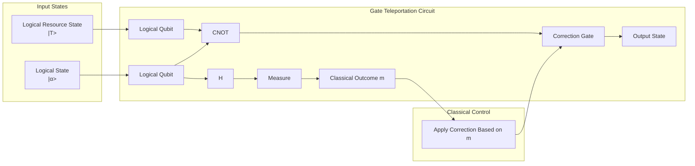
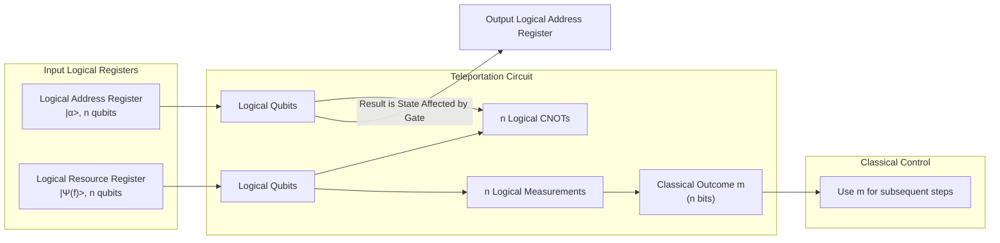

# Chapter 8: Gate Teleportation

Welcome back to the `miniature-guacamole` tutorial!

In our journey towards understanding fault-tolerant QRAM, we've covered a lot of ground: the ideal QRAM operation `V(f)` ([Chapter 1](01_qram_operation_.md)), the challenges of noise and the need for Fault-tolerant Quantum Computation (FTQC) ([Chapter 2](02_fault_tolerant_quantum_computation__ftqc__.md)), the idea of a specialized, potentially noisy, Physical QRAM Device ([Chapter 3](03_physical_qram_device_.md)), how quantum information is protected through Encoding and Quantum Error Correction (QEC) ([Chapter 4](04_encoding_and_quantum_error_correction__qec__.md)), the specific QRAM Resource State needed for our protocol ([Chapter 5](05_qram_resource_state_.md)), and crucially, how to make that resource state high-fidelity using Distillation ([Chapter 6](06_distillation__purity_amplification__.md)).

In [Chapter 7: Logical QRAM Operation](07_logical_qram_operation_.md), we outlined the overall iterative protocol for performing the logical `V(f)` operation using distillation and something called **Gate Teleportation**.

This chapter is dedicated to understanding **Gate Teleportation** itself. What is it, and how does it allow us to apply a quantum gate using a specially prepared state?

## What Problem Does Gate Teleportation Solve?

Imagine you have a logical qubit, perfectly protected by quantum error correction. You want to apply a specific, complex logical gate to it – let's say, a logical T gate. A logical T gate might be difficult to perform directly on the encoded qubits using simple interactions. Perhaps it requires a very complex sequence of lower-level gates, or maybe it's simply not a "native" operation in your chosen QEC code.

Gate teleportation offers an alternative. Instead of applying the difficult gate directly to your state, you _consume_ a specially prepared quantum state (a **resource state**) and use some _easy_ standard gates (like logical CNOTs and measurements) to effectively apply the desired gate's action to your original state. It's like transferring the effect of the gate using entanglement and measurement.

The key benefit, especially in FTQC, is that if the hard gate is difficult to implement fault-tolerantly, but the resource state for that gate can be _prepared_ fault-tolerantly (often via distillation, as we saw in [Chapter 6](06_distillation__purity_amplification__.md)), and the standard gates needed for teleportation (like CNOTs and measurements) _are_ easy to implement fault-tolerantly, then you've found a way to apply the hard gate reliably!

## Gate Teleportation: The Basic Idea (Using the T Gate)

Let's illustrate the concept with the simplest example: teleporting a single-qubit T gate.

The T gate is a common non-Clifford gate needed for universal quantum computation. Applying a logical T gate ($\ol{T}$) fault-tolerantly can be challenging. However, we can perform $\ol{T}$ teleportation if we have a logical **T resource state**, which is defined as:

$$ \ket{\ol{T}} = \ol{T} \ket{\ol{+}} = \frac{1}{\sqrt{2}}(\ket{\ol{0}} + e^{i\pi/4}\ket{\ol{1}}) $$

Here, $\ket{\ol{+}} = (\ket{\ol{0}} + \ket{\ol{1}})/\sqrt{2}$ is the logical plus state, and $\ket{\ol{T}}$ is the logical T gate applied to it. This state is prepared separately. For FTQC, this would be a high-fidelity logical state obtained through distillation ([Chapter 6](06_distillation__purity_amplification__.md)) or other methods.

Now, suppose you have an arbitrary logical state $\ket{\ol{\alpha}}$ (which you want to apply $\ol{T}$ to) and a fresh copy of the logical T resource state $\ket{\ol{T}}$. The gate teleportation protocol for $\ol{T}$ involves these steps:

1.  Start with your state $\ket{\ol{\alpha}}$ and the resource state $\ket{\ol{T}}$.
2.  Apply a logical CNOT gate controlled by $\ket{\ol{\alpha}}$ and targeting $\ket{\ol{T}}$.
3.  Apply a logical Hadamard gate ($\ol{H}$) to the $\ket{\ol{\alpha}}$ qubit.
4.  Measure the $\ket{\ol{\alpha}}$ qubit in the computational basis, getting outcome $m \in \{0,1\}$.
5.  Apply a correction gate to the _other_ qubit (which initially held $\ket{\ol{T}}$) based on the measurement outcome $m$.

Let's visualize this simplified process conceptually:

If you work through the quantum mechanics (we'll skip the math details here for simplicity), you'll find something remarkable happens:

- The outcome `m` is uniformly random (0 or 1) and doesn't reveal information about the original state $\ket{\ol{\alpha}}$.
- The state of the second qubit (which started as $\ket{\ol{T}}$) after measurement and correction is **exactly** $\ol{T}\ket{\ol{\alpha}}$!

Essentially, the $\ket{\ol{\alpha}}$ qubit "sacrifices" itself via entanglement and measurement, and in doing so, transfers the desired gate's effect onto the resource state qubit. The resource state is "consumed" or "used up" in the process.

## Teleporting the Logical QRAM Operation $\ol{V(f)}$

Now let's apply this concept to our $n$-qubit Logical QRAM operation, $\ol{V(f)}$.

As we saw in [Chapter 5: QRAM Resource State](05_qram_resource_state_.md), the ideal logical resource state for $\ol{V(f)}$ is:

$$ \ket{\ol{\Psi(f)}} = \ol{V(f)} \ket{\ol{+}}^{\otimes n} = \frac{1}{\sqrt{2^n}} \sum\_{x \in \{0,1\}^n} (-1)^{f(x)} \ket{\ol{x}} $$

This is an $n$-qubit logical state. To teleport the $\ol{V(f)}$ gate onto an arbitrary $n$-qubit logical address register in state $\ket{\ol{\alpha}} = \sum_x \alpha_x \ket{\ol{x}}$, we follow a similar procedure to the T gate:

1.  Start with your logical address register in state $\ket{\ol{\alpha}}$ and a fresh copy of the logical resource state $\ket{\ol{\Psi(f)}}$. Both are $n$-qubit registers, where each qubit is a logical qubit.
2.  Apply $n$ logical CNOT gates in parallel. Each CNOT is controlled by the $i$-th logical qubit of the address register and targets the $i$-th logical qubit of the resource state.
3.  Measure all $n$ logical qubits of the resource state in the computational basis. This gives you an $n$-bit classical outcome, let's call it `m`.

This process was shown conceptually in the previous chapter, but here we focus just on the teleportation part:

*(Note: This diagram omits the Hadamard and correction step seen in the simple T-gate example. For $\ol{V(f)}$, which is a diagonal gate in the computational basis, the CNOTs and measurement *on the resource state* are the primary steps. The "correction" manifests differently, as explained next).*

After this procedure, the logical address register contains a state related to $\ol{V(f)}\ket{\ol{\alpha}}$, but specifically it contains $\ol{V(f^{\oplus m})}\ket{\ol{\alpha}}$, where $f^{\oplus m}$ is a modified dataset function determined by the original function $f$ and the measurement outcome `m`. As discussed in [Chapter 7](07_logical_qram_operation_.md) and will be detailed in [Chapter 9](09_classical_update_rule__ur__.md), $f^{\oplus m}(x) = f(x \oplus m)$.

So, the teleportation doesn't give us _exactly_ $\ol{V(f)}$ directly, but it gives us a very similar operation $\ol{V(f^{\oplus m})}$. The key is that this process consumes a clean logical resource state and uses standard fault-tolerant CNOTs and measurements.

## The Role of Distillation and Fidelity

The Gate Teleportation protocol relies on having a high-fidelity logical resource state (e.g., $\ket{\ol{T}}$ or $\ket{\ol{\Psi(f)}}$). If the resource state is noisy (a mixed state rather than a pure state), the teleported gate will also be noisy.

This is precisely why the **Distillation** step described in [Chapter 6](06_distillation__purity_amplification__.md) is so crucial. Our physical QRAM device produces a _noisy physical_ QRAM resource state. This is then encoded into a _noisy logical_ state. The distillation process takes multiple copies of this noisy logical state and outputs one or more copies of a much _higher-fidelity_ logical resource state. This high-fidelity state is what we feed into the gate teleportation circuit.

The higher the fidelity of the input resource state for teleportation, the closer the output channel will be to the ideal desired gate ($\ol{V(f^{\oplus m})}$ in our case), and the lower the logical error introduced by this step of the protocol.

## Why is this Useful for QRAM?

Remember the challenge: implementing $\ol{V(f)}$ directly with standard fault-tolerant gates is exponentially expensive ($O(2^n)$). Our physical QRAM device might be able to _prepare_ the resource state $|\Psi(f)\rangle$ quickly on physical qubits, but its output is noisy, and we can't apply it directly to our logical address register.

Gate Teleportation provides the elegant solution:

1.  Use the fast (even if noisy) physical QRAM device to prepare noisy _physical_ resource states ([Chapter 3](03_physical_qram_device_.md), [Chapter 5](05_qram_resource_state_.md)).
2.  Encode these into noisy _logical_ resource states ([Chapter 4](04_encoding_and_quantum_error_correction__qec__.md)).
3.  Use the fault-tolerant quantum processor's capabilities to **Distill** these noisy logical states into high-fidelity logical resource states ([Chapter 6](06_distillation__purity_amplification__.md)). This is where quantum error correction and standard logical gates are heavily used to fight noise and purify the state.
4.  Use the high-fidelity logical resource state in a **Gate Teleportation** protocol with standard fault-tolerant logical CNOTs and measurements (this chapter). This applies the desired $\ol{V(f^{\oplus m})}$ operation to the address register.

This entire pipeline leverages the speed of the specialized device for state preparation and the reliability of the main FTQC processor for state purification and application via standard logical gates, without needing an exponential number of general-purpose logical gates for the $\ol{V(f)}$ operation itself.

## Conclusion

In this chapter, we explored **Gate Teleportation**, a powerful technique in quantum computation that allows us to apply a quantum gate to a state by consuming a specially prepared entangled "resource state" and performing standard gates and measurements. We saw how this works conceptually for a simple T gate and, more importantly for our project, for the $n$-qubit logical QRAM operation $\ol{V(f)}$. The teleportation of $\ol{V(f)}$ uses the logical QRAM resource state $\ket{\ol{\Psi(f)}}$ (distilled to high fidelity) and applies the operation $\ol{V(f^{\oplus m})}$ to the target register, where `m` is a classical measurement outcome.

Gate Teleportation is a cornerstone of our fault-tolerant QRAM protocol because it provides a way to apply the $\ol{V(f)}$ operation reliably by using distilled resource states and standard fault-tolerant gates, circumventing the need for an exponentially large logical circuit.

The classical measurement outcome `m` from the teleportation is not just noise; it's crucial information that determines exactly which version of the QRAM operation ($\ol{V(f^{\oplus m})}$) was applied. In the next chapter, we'll examine the **Classical Update Rule (UR)**, which uses this measurement outcome to determine the target function for the _next_ round of the iterative protocol, guiding us closer to the desired $\ol{V(f)}$ operation.

[Classical Update Rule (UR)](09_classical_update_rule__ur__.md)

---

Generated by [AI Codebase Knowledge Builder](https://github.com/The-Pocket/Tutorial-Codebase-Knowledge). **References**: [[1]](https://github.com/BorissovAnton/miniature-guacamole/blob/561cc0eae83fae19829c1a65c3478067f59cdeef/main.tex)
