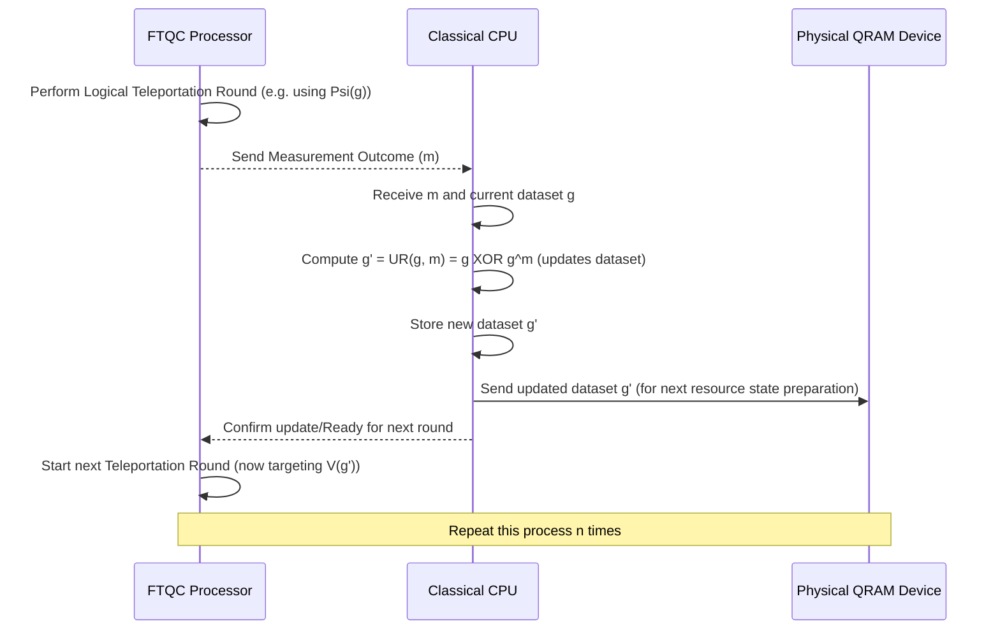

# Chapter 9: Classical Update Rule (UR)

Welcome back to the `miniature-guacamole` tutorial!

In the last few chapters, we've been building up the complex recipe for performing the QRAM operation `V(f)` fault-tolerantly. We learned about the noisy [Physical QRAM Device](03_physical_qram_device_.md) and how its output needs to be protected using [Encoding and Quantum Error Correction (QEC)](04_encoding_and_quantum_error_correction__qec__.md). We then saw how to create a clean [QRAM Resource State](05_qram_resource_state_.md) from the noisy physical output using [Distillation (Purity Amplification)](06_distillation__purity_amplification__.md). Finally, in [Chapter 8: Gate Teleportation](08_gate_teleportation_.md), we learned how this clean resource state is used with standard fault-tolerant gates to apply the desired logical QRAM operation $\ol{V(g)}$ to our address register.

But there was a twist! The teleportation process didn't apply exactly $\ol{V(g)}$ but rather $\ol{V(g^{\oplus m})}$, where $m$ was a random classical measurement outcome obtained during the teleportation. We need a way to account for this variation and steer the computation back towards the _original_ desired operation $\ol{V(f)}$.

This is where the **Classical Update Rule (UR)** comes in.

## What is the Classical Update Rule?

Think back to the iterative protocol we outlined in [Chapter 7: Logical QRAM Operation](07_logical_qram_operation_.md). We start with the goal of applying $\ol{V(f)}$. We perform the first round of teleportation using the resource state $\ket{\ol{\Psi(f)}}$, and we get a classical $n$-bit measurement outcome $m_1$. The operation actually applied to our address register is $\ol{V(f^{\oplus m_1})}$.

We wanted $\ol{V(f)}$. What we got was $\ol{V(f^{\oplus m_1})}$. To correct for this, we need to somehow apply the "missing" part of the transformation, which is equivalent to applying the operation $\ol{V(f)} (\ol{V(f^{\oplus m_1})})^{-1}$. Since $\ol{V(g)}$ is its own inverse (applying the phase $(-1)^{g(x)}$ twice is like multiplying by $(-1)^2=1$), the required correction is $\ol{V(f)} \ol{V(f^{\oplus m_1})} = \ol{V(f \oplus f^{\oplus m_1})}$.

The **Classical Update Rule (UR)** is the computation that takes the _current_ target function (let's call it $g$) and the measurement outcome ($m$) from the latest teleportation step, and computes the _new_ target function ($g'$) for the _next_ round.

The rule is:

$$
g' = \text{UR}(g, m) = g \oplus g^{\oplus m}
$$

Let's break down what this means:

- `g`: This is the classical dataset (the $2^n$ bits) that defined the QRAM operation $\ol{V(g)}$ we _intended_ to apply in this round.
- `m`: This is the $n$-bit classical measurement outcome we got from the teleportation circuit ([Chapter 8](08_gate_teleportation_.md)).
- `g'`: This is the new classical dataset for the _next_ round.
- `⊕`: This means adding the datasets bit by bit, modulo 2 (just like XOR). For every address $x$, the value $g'(x)$ is computed as $g(x) \oplus g^{\oplus m}(x)$.
- `g^{⊕m}`: This is a derived dataset based on $g$ and $m$. For any address $x$, the value $g^{\oplus m}(x)$ is defined as the value of the original dataset $g$ at the address $x \oplus m$. Remember, $x \oplus m$ is the $n$-bit string obtained by taking $x$ and XORing each of its bits with the corresponding bit in $m$.

So, for every address $x$ in the $2^n$-sized dataset, the Classical Update Rule calculates the new bit $g'(x)$ by:

1.  Finding the original bit $g(x)$.
2.  Finding the bit $g(x \oplus m)$ from the original dataset $g$ at the _shifted_ address $x \oplus m$.
3.  Taking the XOR of these two bits: $g'(x) = g(x) \oplus g(x \oplus m)$.

## Role in the Iterative Protocol

Let's see how this fits into the overall flow from [Chapter 7](07_logical_qram_operation_.md):

Each round of the fault-tolerant QRAM protocol involves:

1.  **Quantum Step:** Prepare a high-fidelity logical resource state for the _current_ target function ($g$), and use it in gate teleportation. This is done by the FTQC Processor, interacting with the [Physical QRAM Device](03_physical_qram_device_.md) (via state preparation and distillation) and performing logical gates and measurements. This step yields a classical measurement outcome ($m$).
2.  **Classical Step:** The Classical CPU receives the measurement outcome ($m$) and computes the _next_ target function ($g'$) using the Classical Update Rule ($g' = \text{UR}(g,m)$). This new function $g'$ represents the required _correction_ operation $\ol{V(g')}$ needed to get closer to the overall desired $\ol{V(f)}$ operation. The Physical QRAM Device needs access to this new dataset $g'$ for preparing the resource state in the next round.

This process repeats for $n$ rounds. As discussed in [Chapter 7](07_logical_qram_operation_.md), the Classical Update Rule has a special property related to the [Clifford Hierarchy](10_clifford_hierarchy_.md) that ensures the complexity of the target function decreases each round, guaranteeing termination after at most $n$ rounds with a target function that requires no further quantum operations.

## The Exponential Classical Complexity

Now, let's look at the cost of this Classical Update Rule. The input dataset $g$ has $2^n$ bits. The output dataset $g'$ also has $2^n$ bits. To compute each output bit $g'(x)$, we need to access two input bits, $g(x)$ and $g(x \oplus m)$. Since there are $2^n$ output bits to compute, the classical processor needs to:

- Read $2^n$ bits of $g$ (to get $g(x)$ for all $x$).
- Calculate $x \oplus m$ for all $2^n$ values of $x$.
- Read another $2^n$ bits of $g$ (to get $g(x \oplus m)$ for all $x$).
- Perform $2^n$ XOR operations.
- Write $2^n$ bits for $g'$.

This means the classical computation requires accessing (reading/writing) $O(2^n)$ bits of the classical dataset and performing $O(2^n)$ basic operations (like XOR).

Remember how efficient classical RAM is? It lets you access any single bit in $O(n)$ time if you know the address. But the Classical Update Rule doesn't just need _one_ bit; it needs to compute a function of the _entire_ $2^n$-sized dataset and produce a new $2^n$-sized dataset. Because the classical dataset size is $2^n$, any classical process that must read or write a significant fraction of this data will inherently take time proportional to $2^n$.

This $O(2^n)$ classical complexity is a major point. While the quantum part of the protocol uses only a polynomial number of fault-tolerant quantum resources ($O(\poly(n))$), the essential classical computation needed _after each quantum round_ introduces an exponential cost for the classical computer controlling the process.

This exponential classical cost of the Update Rule is the primary reason why achieving "cheap" QRAM (where the total cost, both quantum and classical, is polynomial in $n$) is so challenging with this type of protocol. You are essentially trading $O(2^n)$ quantum resources (needed for a purely circuit-based fault-tolerant `V(f)`) for $O(n \cdot 2^n)$ classical resources (from running the Update Rule $n$ times). While this trade might be beneficial because quantum operations are currently much more expensive than classical ones, it doesn't eliminate the exponential scaling entirely from the overall computation.

## Conclusion

In this chapter, we introduced the **Classical Update Rule (UR)**, a vital classical computation in our fault-tolerant QRAM protocol. After each round of gate teleportation, this rule takes the previous target function ($g$) and the classical measurement outcome ($m$) to compute the next target function ($g' = g \oplus g^{\oplus m}$). This adaptive update steers the iterative process towards applying the correct overall `V(f)` operation on the logical address register.

We saw that because the classical dataset has $2^n$ entries, the Classical Update Rule involves accessing and processing $O(2^n)$ bits, resulting in an exponential classical complexity ($O(2^n)$). This contrasts with the polynomial quantum complexity and highlights a major consideration for the practicality of truly "cheap" QRAM using this type of protocol.

The reason the Update Rule guarantees termination relates to the structure of the functions it generates, specifically how their complexity decreases in terms of the Clifford hierarchy. In the next chapter, we will delve deeper into the **Clifford Hierarchy** and why it plays a role in ensuring our iterative protocol converges.

[Clifford Hierarchy](10_clifford_hierarchy_.md)

---

Generated by [AI Codebase Knowledge Builder](https://github.com/The-Pocket/Tutorial-Codebase-Knowledge). **References**: [[1]](https://github.com/BorissovAnton/miniature-guacamole/blob/561cc0eae83fae19829c1a65c3478067f59cdeef/main.tex)
