# Chapter 10: Clifford Hierarchy

Welcome back to the `miniature-guacamole` tutorial!

In the last few chapters, we've pieced together how our fault-tolerant QRAM protocol works: using a noisy [Physical QRAM Device](03_physical_qram_device_.md) to prepare noisy [QRAM Resource State](05_qram_resource_state_.md)s, purifying them with [Distillation](06_distillation__purity_amplification__.md), using these clean states in [Gate Teleportation](08_gate_teleportation_.md) to apply the [Logical QRAM Operation](07_logical_qram_operation_.md) ($\ol{V(g)}$), and then using a [Classical Update Rule (UR)](09_classical_update_rule__ur__.md) based on measurement outcomes to determine the correction needed in the next round.

We mentioned that this iterative process, guided by the Update Rule, is guaranteed to terminate after a finite number of rounds (at most $n$). But _why_? What property of the QRAM operation and the Update Rule ensures this step-by-step simplification?

The answer lies in a concept called the **Clifford Hierarchy**.

## What is the Clifford Hierarchy?

Imagine you have different levels of complexity for quantum gates, like difficulty levels in a game. The Clifford hierarchy is a way to classify quantum gates into nested sets, based on how complex they are.

The hierarchy is defined recursively, meaning each level is defined based on the level below it. The definition relates to how a gate transforms the simplest kind of quantum operations: the **Pauli gates**.

### Level 1: Pauli Gates ($\mathcal{C}_1$)

At the very bottom (Level 1) are the Pauli gates: $\ol{I}$ (Identity), $\ol{X}$ (bit flip), $\ol{Y}$ (bit and phase flip), and $\ol{Z}$ (phase flip), and their combinations like $\ol{X}\ol{Z}$, along with phases like $\iUnit \ol{X}$. These are the simplest, most fundamental quantum operations. In Fault-tolerant Quantum Computation ([Chapter 2](02_fault_tolerant_quantum_computation__ftqc__.md)), logical Pauli gates ($\ol{X}, \ol{Y}, \ol{Z}$) are often the easiest to implement fault-tolerantly.

### Level 2: Clifford Gates ($\mathcal{C}_2$)

The next level (Level 2) contains the **Clifford gates**. These are gates that have a special property: when you apply the gate, then a Pauli gate, then the inverse of the gate ($G P G^{-1}$), the result is _always_ another Pauli gate (up to a phase).

For example, the Hadamard gate ($\ol{H}$) is a Clifford gate. $\ol{H} \ol{X} \ol{H} = \ol{Z}$, and $\ol{H} \ol{Z} \ol{H} = \ol{X}$. It transforms Paulis into other Paulis. Other examples include the Phase gate ($\ol{S}$) and the Controlled-NOT gate ($\ol{CNOT}$). Clifford gates, while more complex than Paulis, are also generally considered "easy" to implement fault-tolerantly compared to higher levels of the hierarchy.

### Level 3: Gates that Transform Paulis to Clifford Gates ($\mathcal{C}_3$)

Level 3 contains gates that, when you apply the gate, a Pauli, and the inverse of the gate ($G P G^{-1}$), the result is _always_ a Clifford gate (something in $\mathcal{C}_2$).

A classic example is the $\ol{T}$ gate. The $\ol{T}$ gate is a diagonal phase gate that applies a phase of $e^{i\pi/4}$ to the $\ket{\ol{1}}$ state. $\ol{T} \ol{X} \ol{T}^{-1}$ is not a simple Pauli; it's related to $\ol{SX}$, which is a Clifford operation. Gates in $\mathcal{C}_3$ (and higher) are generally "hard" to implement fault-tolerantly using simple circuits, often requiring techniques like [Gate Teleportation](08_gate_teleportation_.md) using special resource states (like the $\ket{\ol{T}}$ "magic state" mentioned in [Chapter 5](05_qram_resource_state_.md)).

### Higher Levels ($\mathcal{C}_k$)

This pattern continues. A gate $G$ is in level $\mathcal{C}_k$ if, for any Pauli operator $P$, the gate $G P G^{-1}$ is in level $\mathcal{C}_{k-1}$.

The hierarchy is nested: $\mathcal{C}_1 \subset \mathcal{C}_2 \subset \mathcal{C}_3 \subset \dots$. Gates in lower levels are simpler or easier to handle fault-tolerantly. If a gate is in $\mathcal{C}_k$, it's also technically in all higher levels $\mathcal{C}_{k+1}, \mathcal{C}_{k+2}, \dots$. But when we say a gate is _in_ $\mathcal{C}_k$, we usually mean it's in $\mathcal{C}_k$ but not in $\mathcal{C}_{k-1}$.

## The QRAM Operation in the Clifford Hierarchy

Our target operation is the $n$-qubit logical QRAM gate $\ol{V(f)}$, which applies a phase $(-1)^{f(x)}$ to each basis state $\ket{\ol{x}}$.

$$
\ol{V(f)} \ket{\ol{x}} = (-1)^{f(x)} \ket{\ol{x}}
$$

Where does this gate fit in the hierarchy? It turns out that for an $n$-bit dataset $f$, the gate $\ol{V(f)}$ is in level $\mathcal{C}_d$, where $d$ is the **polynomial degree** of the Boolean function $f(x)$. Remember from [Chapter 9](09_classical_update_rule__ur__.md) that $f(x)$ can be written as a polynomial over $\mathbb{F}_2$ (bits added/multiplied modulo 2). The maximum possible degree for a function of $n$ bits is $n$.

So, for a general $n$-bit dataset $f$, the $\ol{V(f)}$ operation is in level $\mathcal{C}_n$. This confirms it's a complex gate, requiring sophisticated techniques like those we've built up.

## How the Update Rule Descends the Hierarchy

Now we see why the Clifford Hierarchy is key to our protocol's termination.

Our iterative protocol works by applying a sequence of operations, aiming for the product of these operations to be $\ol{V(f)}$. In each round $j$, we successfully apply $\ol{V(g^{(j)\oplus m^{(j)}})}$ via gate teleportation, where $g^{(j)}$ is the target function for that round and $m^{(j)}$ is the random measurement outcome. The [Classical Update Rule (UR)](09_classical_update_rule__ur__.md) then calculates the function for the _next_ round's target operation ($g^{(j+1)}$) such that $\ol{V(g^{(j+1)})}$ is the required correction operation.

$$
g^{(j+1)} = \text{UR}(g^{(j)}, m^{(j)}) = g^{(j)} \oplus (g^{(j)})^{ \oplus m^{(j)}}
$$

Here's the critical connection: Applying the Update Rule to a function $g^{(j)}$ has a special property related to its polynomial degree. As discussed in [Chapter 9](09_classical_update_rule__ur__.md) (and formally proven in the paper), if the polynomial degree of $g^{(j)}$ is $d$, then the polynomial degree of $g^{(j+1)} = \text{UR}(g^{(j)}, m^{(j)})$ is **at most $d-1$**.

This means each application of the Classical Update Rule produces a new target function whose corresponding QRAM gate belongs to a _lower_ level of the Clifford Hierarchy:

- Round 1: Target function $f$. $\deg(f) \leq n$. $\ol{V(f)}$ is in $\mathcal{C}_n$. We apply $\ol{V(f^{\oplus m^{(1)}})}$. Correction needed: $\ol{V(\text{UR}(f, m^{(1)}))}$. Let $g^{(2)} = \text{UR}(f, m^{(1)})$. $\deg(g^{(2)}) \leq n-1$. $\ol{V(g^{(2)})}$ is in $\mathcal{C}_{n-1}$.
- Round 2: Target function $g^{(2)}$. $\deg(g^{(2)}) \leq n-1$. $\ol{V(g^{(2)})}$ is in $\mathcal{C}_{n-1}$. We apply $\ol{V(g^{(2)}\oplus m^{(2)})}$. Correction needed: $\ol{V(\text{UR}(g^{(2)}, m^{(2)}))}$. Let $g^{(3)} = \text{UR}(g^{(2)}, m^{(2)})$. $\deg(g^{(3)}) \leq n-2$. $\ol{V(g^{(3)})}$ is in $\mathcal{C}_{n-2}$.
- ...
- Round $n$: Target function $g^{(n)}$. $\deg(g^{(n)}) \leq 1$. $\ol{V(g^{(n)})}$ is in $\mathcal{C}_1$ or $\mathcal{C}_0$ (a constant function counts as degree 0). We apply $\ol{V(g^{(n)}\oplus m^{(n)})}$. Correction needed: $\ol{V(\text{UR}(g^{(n)}, m^{(n)}))}$. Let $g^{(n+1)} = \text{UR}(g^{(n)}, m^{(n)})$. $\deg(g^{(n+1)}) \leq 0$.

A Boolean function with degree 0 must be a constant function, either $f(x) = 0$ for all $x$ (the zero function, $\mathbf{0}$) or $f(x) = 1$ for all $x$ (the constant one function, $\mathbf{1}$).

- If $g^{(n+1)} = \mathbf{0}$, the required correction is $\ol{V(\mathbf{0})} = \ol{\text{Identity}}$, which is the simplest possible operation (in $\mathcal{C}_0$).
- If $g^{(n+1)} = \mathbf{1}$, the required correction is $\ol{V(\mathbf{1})} = -\ol{\text{Identity}}$, which is just a global phase (also in $\mathcal{C}_0$).

In either case, after at most $n$ rounds, the function defining the required correction has degree 0, meaning the corresponding QRAM gate is trivial (Identity up to a sign). No further quantum operations are needed to achieve the desired overall $\ol{V(f)}$ transformation (up to a global phase).

The Clifford Hierarchy, combined with the degree-reducing property of the Classical Update Rule, provides the formal guarantee that our iterative fault-tolerant QRAM protocol terminates after a predictable number of steps, successfully applying the desired logical `V(f)` operation by breaking it down into a sequence of operations that fall down the hierarchy until they become trivial.

```mermaid
flowchart TD
    A["Start: Target V(f)"] --> B{"deg(f) <= n"}
    B --> C{"Round 1"}
    C --> D["Teleport V(f). Get m1"]
    D --> E["Correction Needed: V(UR(f, m1))"]
    E --> F{"Let g2 = UR(f, m1)<br/>deg(g2) <= n-1"}
    F --> G{"Round 2"}
    G --> H["Teleport V(g2). Get m2"]
    H --> I["Correction Needed: V(UR(g2, m2))"]
    I --> J{"... Repeat n times ..."}
    J --> K{"Round n"}
    K --> L["Teleport V(gN). Get mN"]
    L --> M["Correction Needed: V(UR(gN, mN))"]
    M --> N{"Let g(n+1) = UR(gN, mN)<br/>deg(g(n+1)) <= 0"}
    N --> O["g(n+1) is constant (0 or 1)"]
    O --> P["Correction is V(0) or V(1)"]
    P --> Q{"Trivial / Global Phase"}
    Q --> R["Protocol Terminates"]

    style A fill:#f9f,stroke:#333,stroke-width:2px
    style C fill:#ccf,stroke:#333,stroke-width:2px
    style D fill:#cff,stroke:#333,stroke-width:2px
    style E fill:#ffc,stroke:#333,stroke-width:2px
    style G fill:#ccf,stroke:#333,stroke-width:2px
    style H fill:#cff,stroke:#333,stroke-width:2px
    style I fill:#ffc,stroke:#333,stroke-width:2px
    style K fill:#ccf,stroke:#333,stroke-width:2px
    style L fill:#cff,stroke:#333,stroke-width:2px
    style M fill:#ffc,stroke:#333,stroke-width:2px
    style O fill:#eaf,stroke:#333,stroke-width:2px
    style P fill:#eaf,stroke:#333,stroke-width:2px
    style Q fill:#eaf,stroke:#333,stroke-width:2px
    style R fill:#9cf,stroke:#333,stroke-width:2px
```

_(Conceptual flow showing how the Update Rule lowers the polynomial degree of the target function, moving the required correction down the Clifford Hierarchy levels until it is trivial.)_

## Conclusion

In this final chapter, we introduced the **Clifford Hierarchy**, a classification of quantum gates into nested levels based on how they transform Pauli operators. We learned that our $n$-qubit QRAM operation $\ol{V(f)}$ for a general $f$ sits in level $\mathcal{C}_n$. Crucially, the [Classical Update Rule (UR)](09_classical_update_rule__ur__.md) has the property of reducing the polynomial degree of the target function by at least one, meaning the required correction gate $\ol{V(\text{UR}(g,m))}$ always belongs to a lower level of the hierarchy. This ensures that after at most $n$ rounds, the correction needed falls to level $\mathcal{C}_0$ (Identity or global phase), guaranteeing the termination of our iterative fault-tolerant QRAM protocol.

This concludes our tutorial for `miniature-guacamole`. We started with the ideal QRAM operation and the challenge of performing it fault-tolerantly. We then explored the concepts of Fault-tolerant Quantum Computation, physical devices, encoding, resource states, distillation, gate teleportation, and the classical control needed via the Update Rule. Finally, we saw how the structure of the QRAM operation within the Clifford Hierarchy provides the mathematical backbone that guarantees the protocol's success and termination.

Understanding these concepts provides insight into one approach for building complex quantum capabilities, like QRAM, within the challenging reality of noisy quantum hardware.

---

Generated by [AI Codebase Knowledge Builder](https://github.com/The-Pocket/Tutorial-Codebase-Knowledge). **References**: [[1]](https://github.com/BorissovAnton/miniature-guacamole/blob/561cc0eae83fae19829c1a65c3478067f59cdeef/main.tex)
